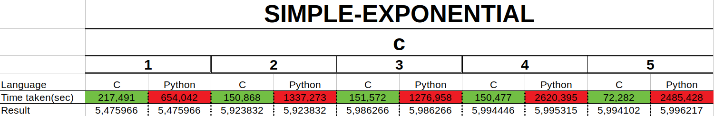
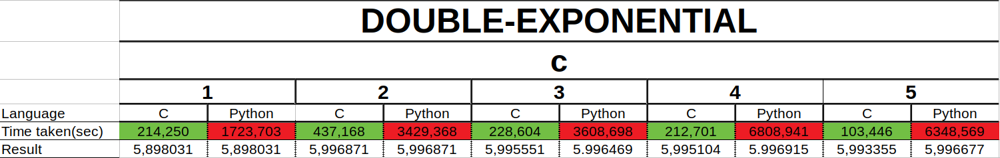

# Solutions strategies for integral with singularities using Gauss-Legendre degree 4 Legendre's polynomial

# Comparations with Python code and C Code

* Simple-Exponential:

* Double-Exponential:

PS: More details on the tests, check the spreadsheet on the comparation folder.

 
